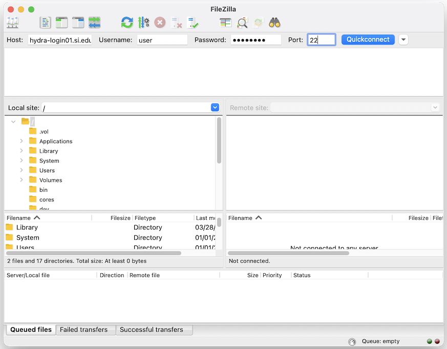

## Hydra Configuration and Data Transfer

### Log into Hydra
Open the terminal app and log onto Hydra. You will need your hydra account password.

### Project-specific Directory 
Go to the the directory assigned to you for short-term storage of large data-sets. Typically this will be `/scratch/genomics/<USERNAME>`

Make a project-specific directory, with the following subdirectories: `jobs` and `data/sra`. -p allows you to create subdirectories and any parental ones that don't already exist (in this case, your project). I typically will create the same directory tree on my local computer.

```
mkdir -p <PROJECT>/data/sra <PROJECT>/jobs
```
```
cd /scratch/genomics/<USER>/<PROJECT>/
```

This is what your current directory tree should look like:

```.
├── data
│   └── sra
└── jobs
```
To see what your final directory will look like, you can go here: [Final_Directory_Tree](https://github.com/SmithsonianWorkshops/Genome_Skimming_Workshop_LAB_2024/blob/main/images/Final_Directory_Tree).

### Hydra Jobs

We will supply "generic" hydra .job files for each program. These files will have some hydra-specific parameters pre-filled (-q, -l), but -N (job name), and -o (log name) should be changed by the user. Likewise, many application-specific parameters will also be prefilled with appropriate values, but paths and filenames will all need to be changed. At the bottom of each .job file is a brief description of the application and descriptions of each parameter listed.

Job files for all programs can be found here: [Genome skimming 2024
 job files](https://github.com/SmithsonianWorkshops/Genome_Skimming_Workshop_LAB_2024/tree/main/job_files) 

Links to application-specific .job files will be in each respective section. To create your own specific job, I copy the text of the .job file from the browser and paste it into a new text file on your laptop. I then make a sample-specific job file by editing the sample name and necessary pathways. Finally, I make make a sample-specific job document in hydra, and copy and paste your job text.


### FileZilla
 We will be using the FileZilla to transfer data from hydra to our local computer. We will go over the FileZilla settings when we need to transfer our first files. You can also choose to use scp to transfer, if you prefer.

Here are the settings to use to connect to Hydra with FileZilla:

