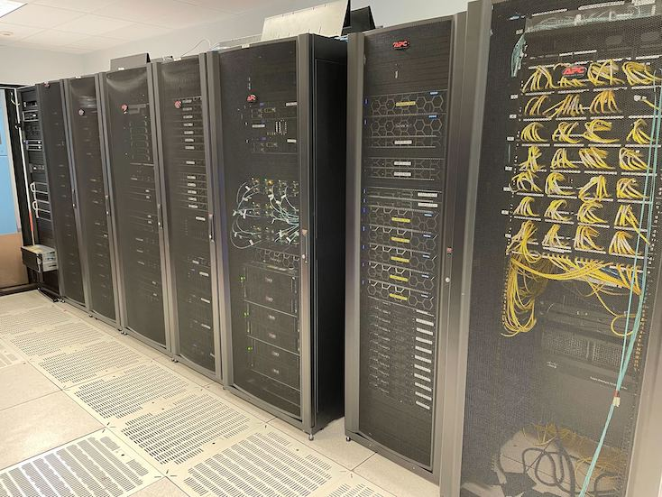

# Introduction to Hydra

---

# Code of conduct 

We are operating under the Carpentries [Code of Conduct](https://docs.carpentries.org/topic_folders/policies/code-of-conduct.html). 

If you feel that someone has violated this Code of Conduct, please email `si-hpc@si.edu`.

---

# Introductions 

---

# Intended outcomes 

After attending this workshop, we hope users come away with these skills:

* How to successfully log in
* How to submit a job
* What to do if something doesn't work
* How to work responsibly on a shared computing resource

---

### People

* Mike Trizna (OCIO Data Science Lab), Alex White (OCIO Data Science Lab), Vanessa González (NMNH ADCS Office), Matt Kweskin (NMNH L.A.B.), Kenneth (Tripp) Macdonald (NMNH L.A.B.), Carlos Arias (STRI) provide support for non-CfA users.

* DJ Ding (OCIO) is the full-time Hydra system administrator.
 
* Sylvain Korzennik (SAO) is the HPC Analyst and provides support for CfA users (and is responsible for the cluster configuration).
 
---

### Getting help 

* The [Wiki](https://confluence.si.edu/display/HPC/High+Performance+Computing) contains detailed documentation
* Email `si-hpc-admin@si.edu` for system-level issues
* For non-CfA users: 
	* 	Bioinformatics Brown Bag (Thursdays, 1-1:30pm ET, on Zoom) 
	* Email `si-hpc@si.edu` (monitored by Matt, Vanessa, Alex, Tripp, Mike) 
* CfA users:
	* email [Sylvain](mailto:hpc@cfa.harvard.edu) or sign up for his [office hours](https://lweb.cfa.harvard.edu/cf/services/cluster/request-office-hours.html).

---

### Being a good Hydra citizen

* We strive to provide support for users that is inclusive, welcoming, and helps you get your science done. 

* We request that users be respectful when asking for help. While we attempt to answer questions rapidly, user support is no one's full-time duties.

* Hydra users agree to abide by its [usage policies](https://confluence.si.edu/display/HPC/Hydra+Policies).

---

# Hydra (SI/HPC)

---

### How is a cluster different than a single-user system?

---

### How is a cluster different than a single-user system?

* Hydra has 90 compute nodes with between 20 and 128 CPUs each, for a total of 4,896 CPUs.

* Compute nodes have a range of 128GB to 2TB RAM each.

* Two compute nodes have 2 GPUs each.

---

### Important Takeaways

* Users never need to connect to the Head Node.

* Log in to either `hydra-login01` or `hydra-login02`.

* Do not run commands that use substantial CPU on the login nodes, that's what the compute nodes are for.

* "*Misuse*" of any resources affect the other users (shared resource).

---

### Disk Storage 

* When you log in, you go to your `/home` directory.

* `/home` is for your own installed programs and scripts, not for data storage.

---

### Disk Storage 

* Data (large files) belong on `/pool` or `/scratch` and users should run their jobs from here.

* `/pool` and `/scratch` are scrubbed - files older than 180 days are removed.

* `/data` offers some unscrubbed storage for small files (final results, configuration files, etc.)

---

### Connecting to Hydra

* telework.si.edu (web terminal)
* Mac direct connect (onsite or VPN)
* Windows direct connect (onsite, remote desktop, VPN)
* CfA (VPN, `login.cfa.harvard.edu`, and *trusted* computers: CF/HEA-managed desktops)
* If you don't have an SI VPN but would like to, there is a request form in the SI [ServiceDesk](https://servicedesk.si.edu)

---

### The job scheduler - UGE

* We use UGE (Univa Grid Engine) to schedule resources on Hydra.

* When you submit a job, UGE adds it to the queue and sends it to a compute
  node with the resources you requested when they become available.

---

### The job scheduler - UGE

* Each job is assigned a JOB ID, which you can use to check on progress and
  look at how it used resources when it is complete.

* UGE limits how many resources each user can use concurrently.

---

### Submitting jobs

* The most common way to run analysis on Hydra is by submitting a job file using the command `qsub`

* We will show you how to build a job file in just a bit

* Users can also start an interactive session using `qrsh`

---

### Queues

Hydra has different queues to accommodate different resource requests:
* High CPU queues: `sThC.q`, `mThC.q`, `lThC.q`, `uThC.q`
* High Memory queues: `sThM.q`, `mThM.q`, `lThM.q`, `uThM.q`

There are other more specialized queues, check the wiki for more information.

---

### Parallelization

* Depending on the software, you may be able to run a job in **parallel**, which can speed up your analysis.
* Some software uses **threaded** parallelization, where the job is divided across CPUs on a single compute node
* Some software can be compiled to use **MPI** parallelization, where the job is divided across multiple compute nodes

---

### Parallelization

Look at software documentation to check which kind of parallelization, if any, your software uses and at the [Wiki](https://confluence.si.edu/display/HPC/High+Performance+Computing) for how to request the needed resources. 

---

### Parallelization hints

* Some (bioinformatics) software will grab all the CPUs on a compute node unless you tell it otherwise (*not appropriate on a shared machine*).

---

### Parallelization hints

* Best practice is to use `$NSLOTS` in place of a number of threads in your command. We will demo this in a bit.

---

### Warnings

* Users that are:
    * Running a job that is inefficient (using <30% of the requested CPU resources), or
    * Running a high-memory job that is using much less than the requested amount of RAM,

will receive an automated warning email. 

*We request that you monitor these jobs closely and contact us if you receive repeated warnings*

---

### Warnings

* When the cluster usage is high, some inefficient jobs will get killed (*fair use* policy).

* Important to receive and read these automatic emails from Hydra (see usage
  policy).

---

# Let's Connect

---
