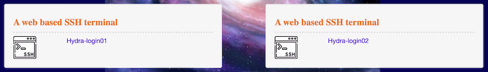

# Hydra: How to login

This document is an introduction to logging into Hydra using various methods.

## Logging In

### Usernames

For Smithsonian users your Hydra username is the same as your SI username (the portion of your email address before `@si.edu`), **all in lowercase**. For SAO users, your username is typically your first initial then your last name.

| When you see `{user}` in this tutorial, replace that with your Hydra username!|
|---|

### Password

Your Hydra password is independent of your Smithsonian network password.

*See the Password Reset section below if you need to reset your password.*

### telework.si.edu

The [telework.si.edu](https://telework.si.edu) system allows any user with a Smithsonian user account to remotely connect to Hydra. It's available from inside the Smithsonian network as well as remotely. There is a web-based terminal program to access Hydra.

After logging in, expand the "IT Tools" section and choose "Hydra".


Click on one of the "SSH terminal" links to start the web terminal connection to one of the login nodes.



At the `login:` prompt, enter your Hydra username and at the `password:` prompt, enter your Hydra password.

### Direct `ssh` connections

When possible, a direct ssh connection from your workstation to Hydra is preferred to using the web-based Telework interface. You'll need to be using a computer located on the Smithsonian network or a remote computer with a VPN connection.

* SI users seeking to request a VPN can do so with [The Remote Access Request form](https://smithsonianprod.servicenowservices.com/si/?id=sc_cat_item&sys_id=cd8bcf38dbaec810faac7c031f961992).
* CfA users should consult with their HPC support staff on how to establish this connection.

#### `ssh` for Windows

For Windows users, we recommend using the ssh client that is built in to the Command prompt of recent Windows versions or The free program, [PuTTY](https://www.chiark.greenend.org.uk/~sgtatham/putty/latest.html).

Open the command prompt from the Start menu (type "command" or "cmd" in the search bar).

In the command prompt window start the hydra connection with: `ssh {user}@hydra-login01.si.edu`. If you get an alert about the authenticity of the host, type `yes`. Enter your Hydra password at the `Password:` prompt.

### `ssh` for Mac

If you are on a Mac, open the Terminal program which can be found in the Utilities folder inside the Applications folder (or type "terminal" in the popup Spotlight search).


Login with your Hydra username and password:

```bash
ssh {user}@hydra-login01.si.edu
```

### Resetting your password

Hydra has a self-service password reset system that you use to set your initial password and other times you need to reset your password (e.g. forgotten or expired password).

There is a link to this page on the page that lists Hydra's web-based tools.

* Telework: go to the Hydra option in "IT Tools" on the Telework site and choose "Password Self Help"
* On-site/VPN: go to <https://galaxy.si.edu/>

There are two pages in the Self Help system. The initial one is to change your password (password changes are required every 180 days).

To create a new password choose "Request an email with a password reset link"


Enter your Hydra **user name** (not email) in the "Login" box and then press Send


A reset link will be emailed to your institutional email account.
